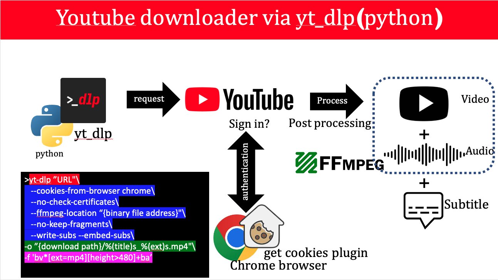

last update: 2025-08-24

# How to download youtube video/playlist in best quality with embedded subtitles via python(yt_dlp)

# Requirements
```
1- python3 (3.8.10 prefered)
2- yt_dlp
3- ffmpeg
```

# Description



# MAC OS

## Installation
```
1. check python (https://www.python.org/downloads/)
python3 --version 

2. install yt_dlp
sudo curl -L https://github.com/yt-dlp/yt-dlp/releases/latest/download/yt-dlp -o /usr/local/bin/yt-dlp
sudo chmod a+rx /usr/local/bin/yt-dlp

3. download ffmpeg binary file (https://www.ffmpeg.org/download.html)
note: no install needed. just it's binary is enough. give the binary path in command
```

## Example 1. Dowload video/playlist with subtitle using cookies
```
yt-dlp "https://www.youtube.com/watch?v=9w8QYW5Wsh0"\
    --cookies-from-browser chrome\
    --no-check-certificates\
    --ffmpeg-location "/Users/meysam/Documents/Develop/utdl/ffmpeg"\
    --no-keep-fragments\
    --write-subs --embed-subs\
    -o "/Users/meysam/Downloads/%(title)s_%(ext)s.mp4"\
    -f 'bv*[ext=mp4][height>720]+ba' 
```
## Example 2. Dowload a section of video
```
yt-dlp "https://www.youtube.com/watch?v=MNw9x53Ybos"\
    --cookies-from-browser chrome\
    --no-check-certificates\
    --ffmpeg-location "/Users/meysam/Documents/binary"\
    --no-keep-fragments\
    --write-subs --embed-subs\
    -o "/Users/meysam/Downloads/youtube/%(title)s_%(ext)s.mp4"\
    --download-sections "*2:00-3:00" --force-keyframes-at-cuts\
    -f 'bv*[ext=mp4][height>480]+ba'

```
## Example 3. Dowload music
```
yt-dlp "https://www.youtube.com/watch?v=FR1WBmpLgRU"\
    --cookies-from-browser chrome\
    --no-keep-fragments\
    -o "/Users/meysam/Downloads/youtube/%(title)s_%(ext)s.mp3"\
    -f 'ba'
```


# WINDOWS
## Installation
```
1. check python (https://www.python.org/downloads/)
python3 --version 

2. download and install yt-dlp.exe (https://github.com/yt-dlp/yt-dlp/releases/latest/download/yt-dlp.exe)
note: create a folder in drive C and add yt-dlp.exe to it. then add its path to env variable. now you can use yt-dlp command in cmd

3. download and install ffmpeg.exe file (https://www.gyan.dev/ffmpeg/builds/packages/ffmpeg-2025-08-25-git-1b62f9d3ae-full_build.7z)
note: create a folder in drive C and add ffmpeg.exe to it. then add its path to env variable. now you can use ffmpeg command in cmd

4. add get cookies plugin (chrome extension) and login to youtube and extract cookies. then give file path to the command
```

## Example 1. Dowload video/playlist with subtitle using cookies
```
yt-dlp "https://www.youtube.com/watch?v=MNw9x53Ybos" `
    --cookies \\Mac\Home\Downloads\www.youtube.com_cookies.txt `
    --no-check-certificates `
    --no-keep-fragments `
    --write-subs --embed-subs `
    -o "\\Mac\Home\Downloads\%(title)s_%(ext)s.mp4" `
    -f 'bv*[ext=mp4][height>480]+ba'
```
## Example 2. Dowload a section of video
```
yt-dlp "https://www.youtube.com/watch?v=MNw9x53Ybos" `
    --cookies \\Mac\Home\Downloads\www.youtube.com_cookies.txt `
    --no-check-certificates `
    --no-keep-fragments `
    --write-subs --embed-subs `
    -o "\\Mac\Home\Downloads\%(title)s_%(ext)s.mp4" `
    --download-sections "*2:00-3:00" `
	--force-keyframes-at-cuts `
    -f 'bv*[ext=mp4][height>480]+ba'
```
## Example 3. Dowload music
```
yt-dlp "https://www.youtube.com/watch?v=FR1WBmpLgRU" `
    --cookies \\Mac\Home\Downloads\www.youtube.com_cookies.txt `
    --no-keep-fragments `
    -o "\\Mac\Home\Downloads\%(title)s_%(ext)s.mp3" `
    -f 'ba'
```

# note (always update yt_dlp before downloading)
```
1- install or update certifi on your os -> python3 -m pip install certifi
2- update yt-dlp to latest version -> yt-dlp -Uv
```