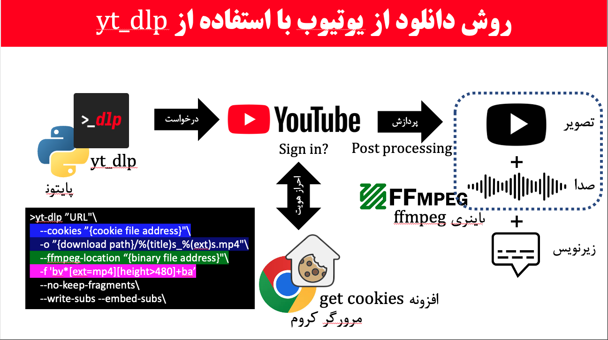

last update: 2025-04-04

# How to download youtube video/playlist in best quality with embedded subtitles via python(yt_dlp)

# Requirements
```
1- python3 (3.8.10 prefered)
2- yt_dlp
3- ffmpeg
4- chrome & gett coockies
```

# Installation
installation on Mac OS
```
1. check python
python3 --version 

2. install yt_dlp
sudo curl -L https://github.com/yt-dlp/yt-dlp/releases/latest/download/yt-dlp -o /usr/local/bin/yt-dlp
sudo chmod a+rx /usr/local/bin/yt-dlp

3. download ffmpeg binary file (https://www.ffmpeg.org/download.html)

4. add get coockies extension to chrome browser (https://chromewebstore.google.com/detail/get-cookiestxt-locally/cclelndahbckbenkjhflpdbgdldlbecc?hl=en)

```

installation on Windows
```
1. check python
python3 --version 

2. download and install yt-dlp.exe

3. download and install ffmpeg.exe file (https://www.ffmpeg.org/download.html)

4. add get coockies extension to chrome browser (https://chromewebstore.google.com/detail/get-cookiestxt-locally/cclelndahbckbenkjhflpdbgdldlbecc?hl=en)

```
# Description
```





```

# Example 1. Dowload video/playlist with subtitle using cookies
```
yt-dlp "https://www.youtube.com/watch?v=rH0bpx7I2Dk"\
    --cookies "/Users/meysam/Downloads/www.youtube.com_cookies.txt"\
    -o "/Users/meysam/Downloads/%(title)s_%(ext)s.mp4"\
    --ffmpeg-location "/Users/meysam/Documents/Develop/utdl/ffmpeg"\
    --no-keep-fragments\
    --no-check-certificates\
    --write-subs --embed-subs\
    -f 'bv*[ext=mp4][height>480]+ba' 
```

# Example 2. Dowload video/playlist with subtitle using browser
```
yt-dlp "https://www.youtube.com/watch?v=rH0bpx7I2Dk"\
    --cookies-from-browser chrome\
    -o "/Users/meysam/Downloads/%(title)s_%(ext)s.mp4"\
    --ffmpeg-location "/Users/meysam/Documents/Develop/utdl/ffmpeg"\
    --no-keep-fragments\
    --no-check-certificates\
    --write-subs --embed-subs\
    -f 'bv*[ext=mp4][height>480]+ba' 
```

# Example 3. Dowload a section of video
```
yt-dlp "https://www.youtube.com/watch?v=MNw9x53Ybos"\
    --cookies "/Users/meysam/Downloads/www.youtube.com_cookies (10).txt"\
    --compat-option no-certifi\  
    -o "/Users/meysam/Downloads/youtube/%(title)s_%(ext)s.mp4"\
    --ffmpeg-location "/Users/meysam/Documents/binary"\
    --no-keep-fragments\
    --write-subs --embed-subs\
    --download-sections "*2:00-3:00" --force-keyframes-at-cuts\
    -f 'bv*[ext=mp4][height>480]+ba'
```

# Example 4. Dowload music
```
yt-dlp "https://www.youtube.com/watch?v=5-J1t0rAlOU"\
    --cookies "/Users/meysam/Downloads/www.youtube.com_cookies.txt"\
    -o "/Users/meysam/Downloads/youtube/%(title)s_%(ext)s.mp3"\
    --no-keep-fragments\
    -f 'ba'
```


# note 1
update yt-dlp to latest version
yt-dlp -Uv

# note 2
install or update certifi on your os
python3 -m pip install certifi 